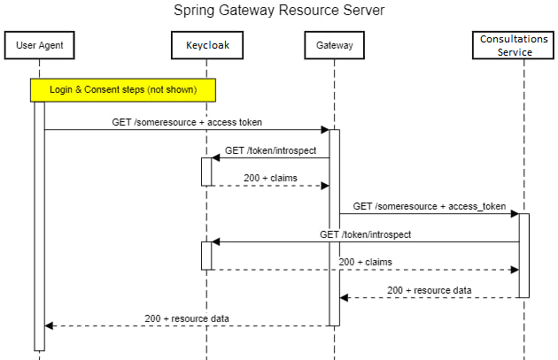

# Consultations Service Demo Project  
Проект представляет собой решение Задания №1 - "Сервис планирования консультаций" в рамках стажировки в компании Promo-IT  

## Использованный стек:
- Java 17
- Spring Framework (security, api-gateway, oauth2, data-jpa, web)
- Lombok
- PostgreSQL
- PgAdmin
- Drools
- Keycloak
- Docker, Docker compose
- Swagger
- HATEOAS

## Разворачивание сервиса
Сборка проекта:
```
$ mvn -f ./api-gateway clean package
$ mvn -f ./consultations-service clean package
```
Запуск проекта через docker-compose
```
$ docker-compose up
```

## Использование сервиса
Сервис представляет собой REST API, эндпоинты которого защищены Spring Security.  
В качестве сервиса аутентификации и авторизации используется Keycloak (механизм управления жизненным циклом токенов в данном проекте не реализован).  

Для обращения к REST API необходимо предварительно обратиться в Keycloak с запросом на получение токена:
```http request
POST http://<host>:8080/realms/PromoIT/protocol/openid-connect/token
``` 
При первом запуске приложения в Keycloak настроено несколько пользователей:

| username            | password            | authority       |
|---------------------|---------------------|-----------------|
| adminko             | adminko             | ROLE_ADMIN      |
| ruler               | ruler               | ROLE_MODERATOR  |
| consultantnumberone | consultantnumberone | ROLE_SPECIALIST |
| junior              | junior              | ROLE_CUSTOMER   |

REST API реализовано в одном сервисе consultations-service.  
Все запросы к нему проходят через Gateway, который выполняет функцию Resource Server:  
  

Реализованные HTTP методы: 
- создание слота для консультации;  
- получение всех слотов;
> Запрос может принимать дополнительные параметры (`date` - указывается для получения слотов на дату;
`startDate`, `endDate` - указывается для получения слотов для периода).  
- получение всех слотов по id специалиста;  
> Запрос может принимать дополнительные параметры (`date` - указывается для получения слотов на дату;
`startDate`, `endDate` - указывается для получения слотов для периода).
- получение слота по его id;
- обновление слота по его id;  
- удаление слота по его id;
- создание резервирования консультации;
- получение всех резервирований консультаций;
- получение всех резервирований консультаций по id слота;
- получение резервирования по его id;
- обновление резервирования по его id;
- удаление резервирования по его id.  

Более подробно методы описаны в swagger:
```http request
http://<host>:8083/swagger-ui/index.html
```
> Для этого у consultations-service проброшен порт из docker контейнера.  
Для продакшена такая возможность должна быть закрыта.

В проекте реализована ролевая модель, ограничивающая возможности пользователей в зависимости от его роли.  

## Что необходимо еще реализовать в проекте
- реализовать тестирование;
- реализовать логирование;
- написать java-doc;
- до конца проработать распределение прав и ролей;
- проработать фильтрацию для методов возвращающих списки 
(например чтобы консультант мог получить только список своих слотов)
- добавить события для уведомления пользователей об изменении статуса их заявки;
- проработать возможность вынести drools-правила из проекта, с целью получения 
возможности их редактирования без пересборки сервиса;
- проработать конфигурацию сетей в docker, как минимум не подключать к дефолтной сети;
- до конца проработать комментарии к таблицам и столбцам;
- реализовать кэширование;
- доработать open-doc документацию;
- реализвовать индексирование таблиц БД;
- доработать ограничения на сущности (сейчас убрана возможность изменения даты и 
времени у существующего слота так как нет проверки на пересечение с другим слотом);
- реализовать json patch update;
- до конца проработать обработку исключительных ситуаций
- реализовать миграцию БД;
- настроить возможность доступа к gui Keycloak.